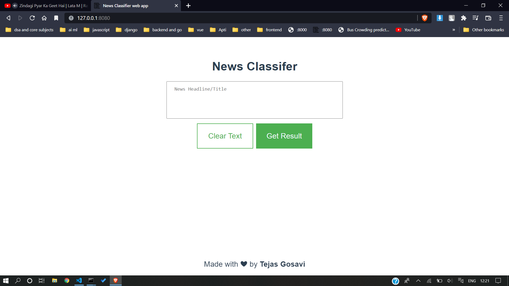
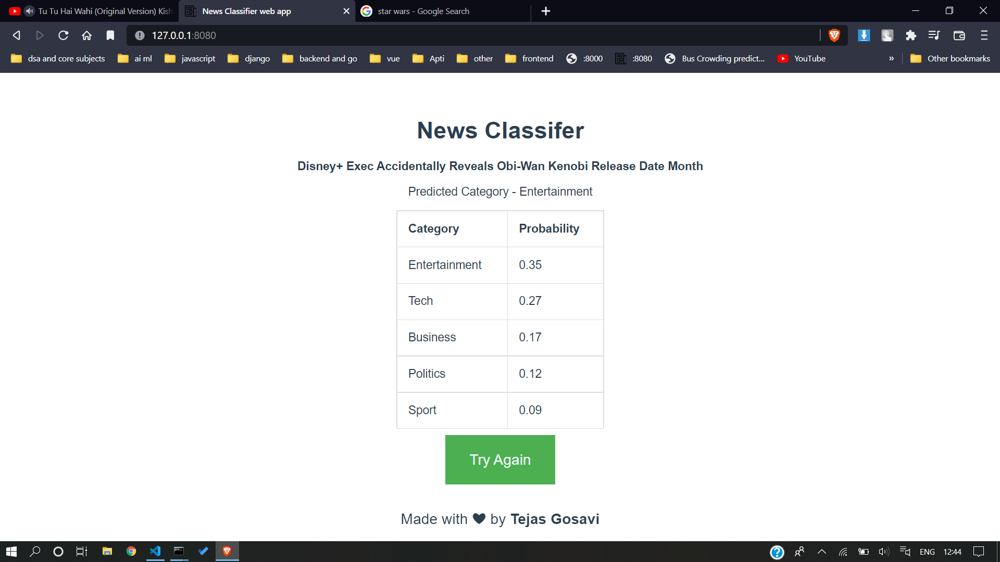
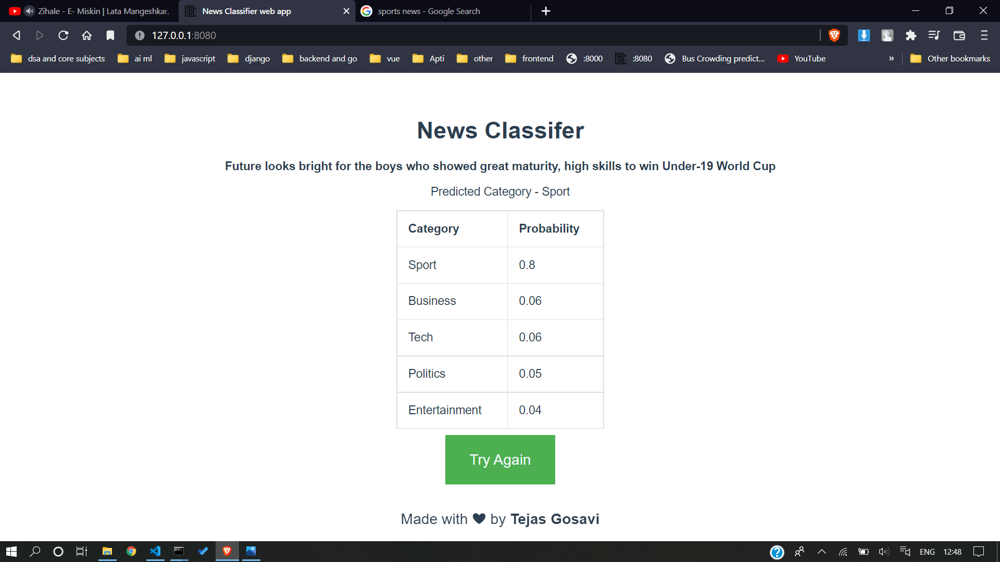
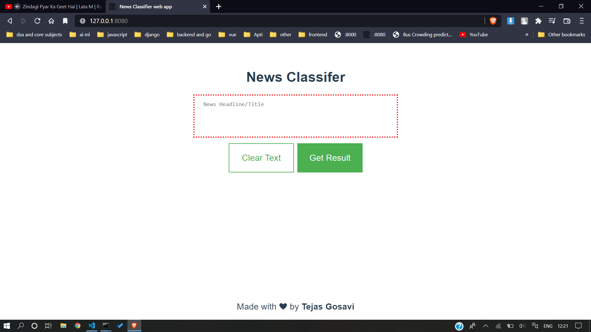

<!-- PROJECT LOGO -->
<div align="center">
<div id="top"></div>
<h3 align="center">News classifier web app.</h3>
</div>
<br />


<!-- TABLE OF CONTENTS -->
<details>
  <summary>Table of Contents</summary>
  <ol>
    <li>
      <a href="#about-the-project">About The Project</a></li>
    <li>
      <a href="#built-with">Built With</a>
    </li>
    <li>
      <a href="#prerequisites">Prerequisites</a>
    </li>
    <li><a href="#usage">Usage</a></li>
    <li><a href="#acknowledgments">Acknowledgments</a></li>
    <!-- <li><a href="#license">License</a></li> -->
  </ol>
</details>


## About The Project
<div id="about-the-project">



* Developed text classifier to classify title/description of News in certain categories.
* Computed and visualized probability of every category
* Coded with Multinomial Naive Bayes algorithm, which is based on Bayes Theorem.
* My CS50X - Introduction to Computer Science Final project.

</div>

<!-- ABOUT THE PROJECT -->
<div id="built-with">

### Built With

* [Flask](https://palletsprojects.com/p/flask/)
* [Vue.js](https://v3.vuejs.org/)
* [Scikit-learn](https://scikit-learn.org/)

<p align="right">(<a href="#top">back to top</a>)</p>

</div> 


<!-- GETTING STARTED -->
<div id="prerequisites">

### Prerequisites

#### You must have these Tool installed.
 - Python
 - Node.js
 - Jupyter notebook
 - Visual studio code

#### You need to install all dependencies related to project.
 - Backend - Refer to this [link](./backend/README.md).
 - Frontend - Refer to this [link](./frontend/README.md).

After installing all dependencies follow these steps. 
1. Open CMD go to /backend dir. of this project and run following command.
      
    ```
    flask run
    ```
    By default, flask will run on port 5000.

2. Open CMD goto /frontend dir. of this project and run following command.
	```
	npm run serve
	```
	By default, Vue.js will run on port 8080.

3. Navigate to URL http://127.0.0.1:8080

4. and... Voila our web app is started.

<p align="right">(<a href="#top">back to top</a>)</p>

</div>


<!-- USAGE EXAMPLES -->
<div id="usage">

## Usage

Some screenshots from my project, soon going to share a demo youtube video link.

| | |
|:-------------------------:|:-------------------------:|
|  Ex.1 |  Ex.2 |
|  Ex.3 |  Ex.4 |
|  Ex.5 |  Error - Empty news |

<p align="right">(<a href="#top">back to top</a>)</p>

</div>


<!-- ACKNOWLEDGMENTS -->
<div id="acknowledgments">

## Acknowledgments

This is list of resources i find helpful and would like to give credit to.

* [ Flask documentation ](https://flask.palletsprojects.com/en/2.0.x/)
* [ Vue.js documentation ](https://v3.vuejs.org/guide/introduction.html)
* [ Scikit-learn documentation ](https://scikit-learn.org/stable/user_guide.html)
* [ GitHub README Template ](https://github.com/othneildrew/Best-README-Template)
* [ StackOverflow - The G.O.A.T](https://stackoverflow.com/)
<p align="right">(<a href="#top">back to top</a>)</p>

</div>


<!-- LICENSE -->
<!-- <div id="license">
## License
Distributed under the MIT License. See `LICENSE.txt` for more information.
<p align="right">(<a href="#top">back to top</a>)</p>
</div> -->